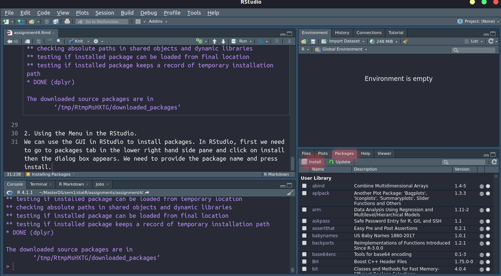
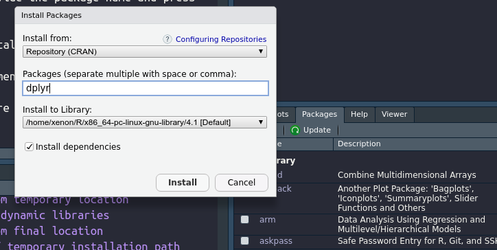
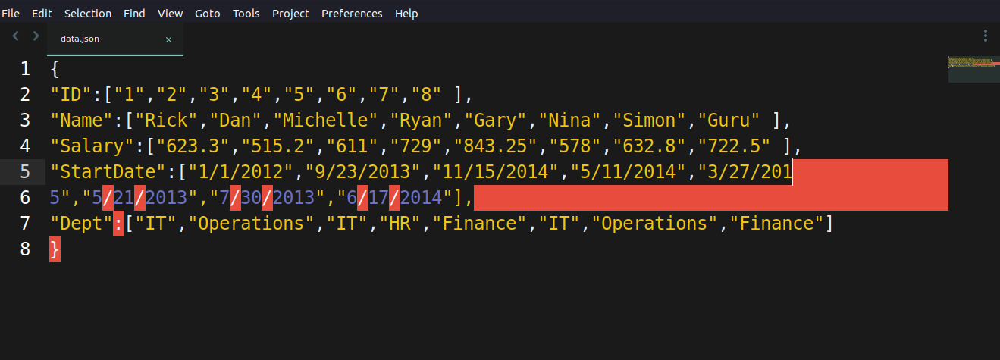

```{r setup, include=FALSE}
knitr::opts_chunk$set(echo = TRUE)
```

# Assignment 4: Packages in R & Tidying and Transforming Data in R

**Instructions**
Solve/do all the examples/exercises of Unit 2 Session 1 (S6) and Session 2 (S7) slides, copy them to the attached word file with discussion and/or interpretation for review, feedback and grading for your own understanding.

## Installing Packages
There are multiple ways of installing packages in R and R studio.

1. Using `install.packages()` function:
We can use `install.packages()` function to install packages from CRAN repository.
```{r}
# Example for install.packages
# Syntax: install.packages('<package_name>')
# install.packages('dplyr')
```

2. Using the Menu in the RStudio.
We can use the GUI in RStudio to install packages. In RStudio, first we need to go to packages tab in the lower right hand side pane and click on install then the dialog box appears. We need to provide the package name and press install.



In the image above we need to click on the menu highlighted in red.
Then we will see a dialog as shown in picture below



3. Using the `devtools` package. This package is used for installing package from github.

```{r}
# If not installed uncomment line below 
# install.packages("devtools")

#Taking Instruction from https://rqda.github.io/RQDA/
#install.packages("devtools") ## install it only if you haven't done it yet
devtools::install_github("RQDA/RQDA", INSTALL_opts = "--no-multiarch")
```

In our case the package was already installed so no need to install for now.

## Reading JSON Data

### Reading JSON data created using a text editor.

The screenshot below shows creation of JSON file in text editor(sublime text)



```{r}
library(rjson)
data<-fromJSON(file="data.json")
print(data)

# Converting the JSON data into a dataframe
json_data_frame<-as.data.frame(data)
print(json_data_frame)
```

#### Histogram of Salary
```{r}
# Converting the salary into Numeric data type
json_data_frame$Salary<-as.numeric(json_data_frame$Salary)
hist(json_data_frame$Salary,main="Histogram of Salary",xlab = "Salary")
```
#### Average salary by department

```{r}
library(dplyr)
json_data_frame%>%group_by(Dept)%>%summarise(avg_salary=mean(Salary))
```

#### Frequency distribution of all variables
```{r}
# install.packages('plyr')
library(plyr)
col_list<-names(json_data_frame[,-1])
for (i in 1:length(col_list)){
cat("Frequency and Pecentage For",col_list[i],"\n")
df_count<-count(json_data_frame[col_list[i]])
print(df_count)
}
```
### Reading JSON file from URL: Web API

```{r}
#install.packages(“jsonlite”)
library(jsonlite)
Raw <- fromJSON("https://data.ny.gov/api/views/9a8c-vfzj/rows.json?accessType=DOWNLOAD")
food_market <- Raw[['data']]
Names <- food_market[,14]
head(Names)
```
```{r}
# table(Names)
```

```{r}
#table(food_market$V19)
```
#### What is atomic vector?

An atomic vector is a one dimensional data object in R. It is created using the `c` or `vector` function

## Web Scrapping. Getting data from Table in a website 

```{r}
library(rvest)
library(dplyr)
wiki_link <- "https://en.wikipedia.org/wiki/COVID-19_pandemic_in_Nepal"
# Reading the whole website
wiki_page <- read_html(wiki_link)
# Getting only the tables from the whole website
tables <- wiki_page %>% html_table(fill = TRUE)
# Printing a sample
print(tables[[2]])
# Getting the Required Table
covid_table <- wiki_page %>%html_nodes("table") %>% .[16] %>%html_table() %>% .[[1]]
print(head(covid_table))
```

